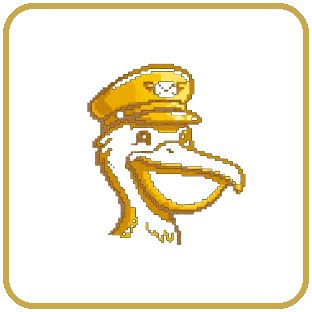

<p align="center">
  
</p>

<h1 align="center">Nigel</h1>

<p align="center">
  Your personal AI assistant that lives quietly in a floating bar on your desktop — always within reach, never in the way.
</p>

---

Nigel is a lightweight desktop assistant built with Python and PyQt6. It floats as a slim, frameless bar at the bottom of your screen and expands into a full chat panel on demand. Under the hood it polls your **Outlook** and **Gmail** inboxes in real time, uses AI to triage what actually matters, and surfaces only the important stuff — so your inbox never interrupts you unless it should.

### Key features

- **Floating chat bar** — a compact, always-on-top prompt pill that expands into a full AI chat panel without opening any extra windows
- **Inbox intelligence** — background workers poll Microsoft Graph (Outlook) and Gmail; an AI layer classifies each message and only notifies you when something is genuinely important
- **Schedule monitoring** — tracks upcoming and overdue events and pops a notification when something needs your attention
- **Persistent memory** — Nigel remembers context across conversations through a local knowledge graph, so every session feels continuous
- **Multi-provider AI** — configurable API backend; switch providers from the Settings panel without restarting
- **Draggable & pinnable** — drag the bar anywhere on screen; toggle "always on top" from the flyout menu

### Tech stack

| Layer | Library |
|---|---|
| UI | PyQt6 6.7 |
| Microsoft mail | MSAL + Microsoft Graph API |
| Google mail | google-api-python-client + OAuth 2.0 |
| HTTP | requests |
| Config | python-dotenv |

### Getting started

```bash
# 1. Clone the repo
git clone https://github.com/sorakes/Nigel.git
cd Nigel

# 2. Create and activate a virtual environment
python -m venv venv
venv\Scripts\activate   # Windows

# 3. Install dependencies
pip install -r requirements.txt

# 4. Copy and fill in your environment variables
copy .env.example .env   # edit with your API keys

# 5. Run
python main.py
```

> **Note:** You will need OAuth credentials for Google (`credentials.json`) and an Azure app registration for Microsoft. See the Settings panel inside Nigel for guidance.

---

<p align="center"><sub>v0.5 — built with ☕ and too many API docs</sub></p>
