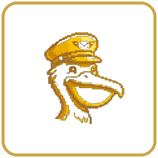

<p align="center">
  
</p>

<h1 align="center">Nigel</h1>

<p align="center">
  Seu assistente pessoal de IA, morando discretamente numa barra flutuante — sempre à mão, nunca no caminho.
</p>

---

Nigel é um assistente de desktop em Python e PyQt6, integrado às suas ferramentas
pelo **Composio**. Ele flutua como uma barra fina na base da tela e se expande num
painel de chat completo, sem abrir nenhuma janela extra.

Por baixo, o Nigel **orquestra subagentes especialistas**: ele delega a tarefa,
lê o relatório de volta e responde. Agenda e e-mail podem ser consultados em
paralelo numa única pergunta.

### O que ele faz

- **Barra flutuante** — um campo de prompt sempre visível, que vira um chat completo
- **Agenda de verdade** — consultar, criar, **remarcar**, **cancelar**, achar horário livre e checar conflitos no Google Calendar
- **E-mail com paridade Gmail ↔ Outlook** — buscar, ler conversas, resumir, rascunhar, responder, arquivar e marcar como lido nas duas contas
- **Pesquisa na web** — o `web_agent` busca (DuckDuckGo, sem chave de API) e lê páginas de verdade, então o Nigel responde com dado atual em vez de conhecimento desatualizado do modelo
- **6 subagentes em paralelo** — `agenda_agent`, `email_agent`, `memory_agent`, `chat_agent`, `apps_agent` e `web_agent`; o Nigel orquestra e sintetiza
- **Slack** — o `chat_agent` acha canais e pessoas, lê e busca mensagens, manda mensagem ou DM
- **11 conectores prontos em Configurações → Integrações** — Google Calendar, Gmail, Outlook, Slack, Notion, Google Drive, GitHub, Discord, Trello, Todoist e Asana; qualquer outro toolkit do Composio também funciona via `apps_agent` assim que conectado
- **Proatividade** — e-mail importante abre um popup sozinho, com ações prontas (responder, arquivar, lembrete)
- **Triagem de caixa de entrada** — workers em background classificam mensagens e só avisam o que importa
- **Lembretes autônomos** — a agenda interna do Nigel, com popups, recorrência e tarefas que ele executa sozinho
- **Grafo de memória** — o Nigel pergunta sobre quem ele ainda não conhece e guarda o que aprende
- **Multi-provider** — Groq, OpenAI, Gemini, OpenRouter, Ollama e Ollama Cloud, trocáveis sem reiniciar

### Como o agente funciona

Uma mensagem sua vira **um** loop observar→agir com *function calling* nativo:

```
você → Nigel → [agenda_agent ∥ email_agent ∥ web_agent ∥ ...] → ferramentas
                     ↓ relatórios
               Nigel lê e responde
```

O Nigel carrega só 13 ferramentas (os 6 subagentes, os lembretes e a pergunta de
contexto). As ~34 ferramentas concretas ficam com os especialistas — o contexto do
orquestrador fica em ~4 KB em vez de bem mais que isso.

Quando o modelo pede uma ferramenta, o **resultado volta para ele**. É isso que
permite buscar um evento, escolher o certo e cancelá-lo numa só mensagem — e é
por isso que o Nigel não afirma ter feito algo que na verdade falhou.

### Stack

| Camada | Biblioteca |
|---|---|
| UI | PyQt6 6.7+ |
| Integrações | Composio SDK (Google Calendar, Gmail, Outlook, e o que você conectar) |
| Pesquisa web | ddgs (DuckDuckGo, sem chave de API) |
| HTTP | requests |
| Config e segredos | python-dotenv, keyring |

### Começando

```bash
git clone https://github.com/sorakes/Nigel.git
cd Nigel
python -m venv venv
venv\Scripts\activate
pip install -r requirements.txt
python main.py
```

Ou dê duplo clique em `start.bat`.

Na primeira execução o Nigel abre **Configurações → Integrações**. Informe sua
`COMPOSIO_API_KEY`, conecte o Google Calendar, e adicione a chave de pelo menos um
provider de IA em **Provedores de IA**.

> **Sobre o modelo:** o loop depende de *function calling*. Modelos fracos nisso
> (vários locais do Ollama, alguns gratuitos do OpenRouter) funcionam pior — o
> Nigel tenta resgatar chamadas que o modelo escreveu como texto, mas o resultado
> é menos confiável. Prefira `llama-3.3-70b-versatile` (Groq), `gpt-4o-mini`
> (OpenAI) ou `gemini-2.0-flash`.

### Variáveis de ambiente úteis

| Variável | Efeito |
|---|---|
| `NIGEL_EMAIL_POPUPS` | `0` desliga o popup de e-mail importante (só o badge continua acendendo). Padrão: ligado |
| `NIGEL_BAR_WIDTH` / `NIGEL_BAR_HEIGHT` | Tamanho da barra |
| `NIGEL_ALWAYS_ON_TOP` | `false` desliga o "sempre visível" |

### De onde veio isso?

Toda superfície que fala de um app conectado mostra o ícone de marca dele — não
um envelope genérico. Configurações → Integrações, o cabeçalho do popup de
e-mail, e a lista de ações do chat mostram Gmail (vermelho), Outlook (azul) ou
Google Calendar (o calendário azul/branco) conforme o caso; um app de terceiros
descoberto pelo `apps_agent` usa o ícone genérico de "outro app". Quando o
`agenda_agent` ou o `email_agent` são chamados, a linha de ação mostra o ícone
do serviço que eles de fato tocaram (por exemplo, "Verificando e-mails" some e
vira o ícone do Gmail assim que a busca decide que só olhou lá) — não duas
linhas redundantes, uma por camada interna.

### Proatividade

Quando a triagem em background classifica um e-mail como importante, o Nigel não
espera você perguntar — abre um popup no mesmo instante, no canto da tela, com o
motivo e ações prontas: **Responder** (com um botão "Sugerir com IA" que rascunha
a resposta), **Arquivar**, **Lida**, **Lembrete** (follow-up em 2h) e **Abrir**.
Um campo de texto livre no rodapé aceita qualquer pedido fora desses botões —
"resume esse e-mail", "recusa educadamente" — e delega ao mesmo agente com
ferramentas de e-mail. Vários popups (lembretes e e-mails) empilham no mesmo
canto sem se sobrepor.

### Aparência

Tema **Grafite**: superfícies neutras em cinza-carvão, com o dourado reservado à
identidade — o logo, o anel de foco e o badge de notificação. Todos os tokens
ficam em `ui/theme.py`; nenhum arquivo de UI escreve cor literal.

### Licença

[MIT](LICENSE) — use, modifique e distribua à vontade.

---

<p align="center"><sub>v0.7 — feito com ☕ e Composio</sub></p>
